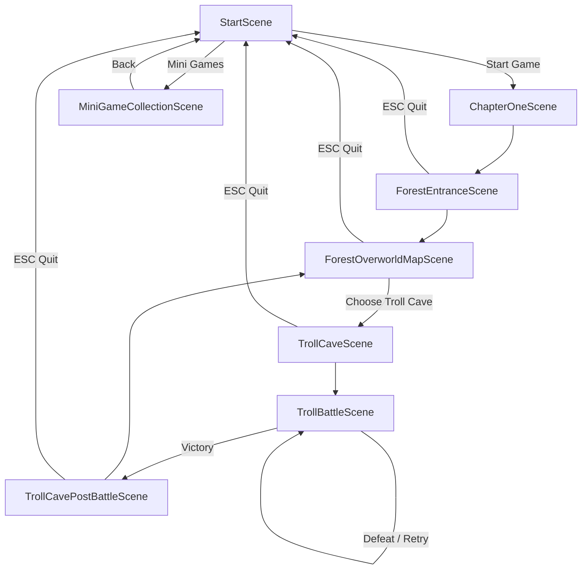
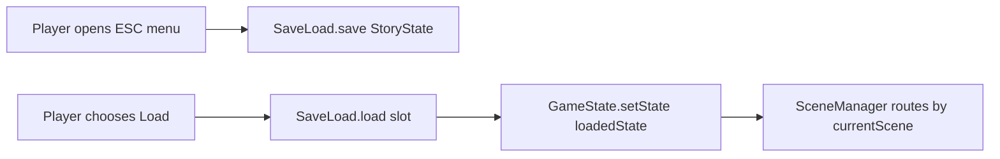

# Logic Flow Diagram

Optional logic flow diagram for gameplay progression (Chapter One + current playable branch).

## Save/load logic (high-level)

## Scene key routing reference

- `chapter_one` -> `ChapterOneScene`
- `forest_entrance` -> `ForestEntranceScene`
- `forest_overworld_map` -> `ForestOverworldMapScene`
- `troll_cave` -> `TrollCaveScene`
- `troll_cave_post_battle` -> `TrollCavePostBattleScene`
